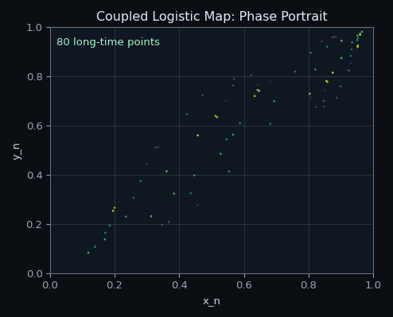

# ENGINEERING-COMPUTING

Projects related to MATLAB, C, numerical computing, simulations, scientific programming, performance-oriented code, and university engineering work.

## Visual Samples

| Acoustic pressure surface | Velocity distribution surface |
| --- | --- |
|  |  |

| Coupled map dynamics | Neural cellular automaton | Vicsek model alignment |
| --- | --- | --- |
|  |  |  |

## Contents

- `desktop-mks-projects` - selected computational/scientific Python projects from local coursework/practice material.
- `acoustic-wave-pde-solver` - 2D acoustic wave equation solver with heterogeneous media, absorbing boundaries, receiver traces, and energy diagnostics.
- `esp32-dht11-oled` - PlatformIO ESP32 embedded project.
- `roadster-numerical-project` - numerical Python project with interpolation, route, and test scripts.
- `usb-assembly` - small assembly experiment from USB material.
- `usb-control-theory` - control theory simulation scripts from USB material.
- `usb-primes-and-c` - prime-number and C practice experiments from USB material.
